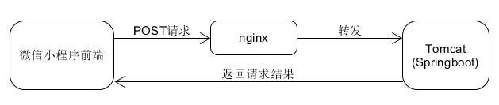

# treehole-server

## 项目展示

<figure class="half">    

</figure>

<figure class="half">    

</figure>

<figure class="half">    

</figure>

## 项目起因

​		在2020八月份，[好朋友](https://github.com/sunnysab)找到我，想让我帮忙写一下[上应小风筝](https://github.com/SIT-Yiban/kite-microapp)(小程序)的迎新页面，当时正当暑假，也没有什么要紧的事，于是就答应了。第一次接触前端，对html，css，js也只是听说过，当时也在找一些资料学习，在学堂在线上发现了一门课程[学做小程序](https://www.xuetangx.com/course/THU0809102418/2300843?channel=learn_title)（本课程是由清华大学软件学院和乐享其约共同制作的微信小程序学习教程，由“乐享其约”资深项目经理、产品经理、前端和后端工程师主讲，微信团队担任技术顾问。通过“需求分析”、“原型设计”、“小程序前端实现”、“后台接口开发”、“小程序对接接口”一步步教同学们如何“从无到有”完成一个小程序项目的开发。），课程最终的目的是开发一款叫做树洞的小程序，后端采用PHP开发，清晰展现了现在软件开发的基本流程，十分推荐。 

​		然后在2021一月份的《JAVA企业级实训》课程设计中，决定对树洞小程序的后端进行重写（课程中所使用的PHPAdmin感觉有点捞，而且并不喜欢这门语言），于是这个项目就诞生了。 

​		当时在组队的时候，并没有找到志同道合的同学一起来写，最终就是单兵作战。但是一个人开发也有一个人的好处（毕竟仅仅是一个课程设计，非常小），从前端的适配，到后端的代码的实现，项目的部署等，我对这些流程有了更深刻的理解，受益匪浅。 

## 框架选择

​		WeUI+Springboot+Mybatis+nginx+MySql 

## 功能说明

#### 用户服务

1. 用户注册
2. 用户登录
3. 手机号验证(前端检测)
4. 获取用户信息
5. 密码校验
6. 密码加密

#### 树洞消息服务

1. 获取所有树洞
2. 时间戳解析
3. 获取用户个人树洞
5. 发布树洞
6. 删除树洞
7. 点赞

## 系统架构图

## 后端结构图

## 配置情况

- OpenJDK 11.0.5
- MySql 8.0.22
- nginx 1.14.0
- maven 3.6.3
- Springboot 2.4.1

## 项目展望

​		现在是大三下(当时大三上)，学校开设了两门课叫做《软件体系结构》和《Web应用系统》，代课老师非常厉害(在学校上了三年学，第一次产生好想听他讲课的情绪)，学到了许多干货，现在对于前后端的认识比上学期深入了很多。除了老师讲课之外，还学习了一个比较有规模的后端项目[Supermarket](https://github.com/GoogleLLP/SuperMarket)，这个项目的结构还挺复杂，模块很多，干货很多。如今回头来看，当时由于第一次接触后端，没有经验，对于Springboot也不熟悉，再加上课设时间有限，所以这个树洞项目的结构设计，包的构建，框架的选择等等都有很多问题。于是计划本学期对该树洞小程序进行重写。

- 整理一下代码结构(低耦合，高内聚)
- 重构部分函数(高扇入，低扇出)
- 搭建微服务框架
- 引入一些新的组件
- 增加一些新的功能
- 增加对于其他端的支持(Web,App)
- 加入Redis进行缓存
- 或许还能使用其他的体系结构实现
- .......

想法真有好多，慢慢来吧。

长路漫漫，道阻且艰，一起加油吧！

​																																					2021.04.08